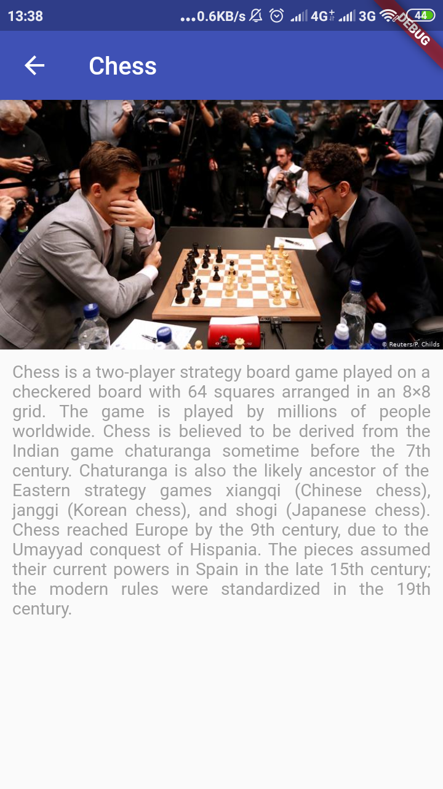

# Flutter Basic Tugas 3

Aplikasi mengenai macam-macam olahraga populer di seluruh dunia

## Screenshot

## Teknologi Yang Digunakan
Flutter:
- Gridview
- List
- Inkwell
- SingleChildScrollView

## Dibuat Oleh
Ikhsan Khoerul Rohman

